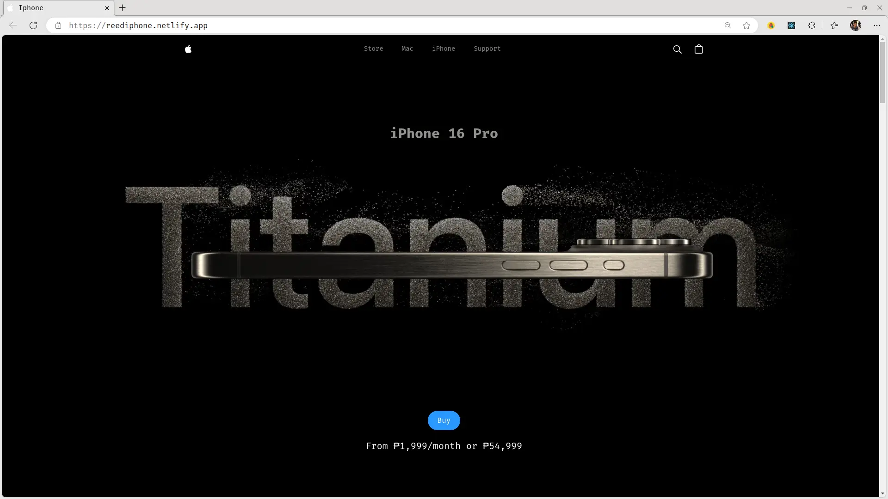
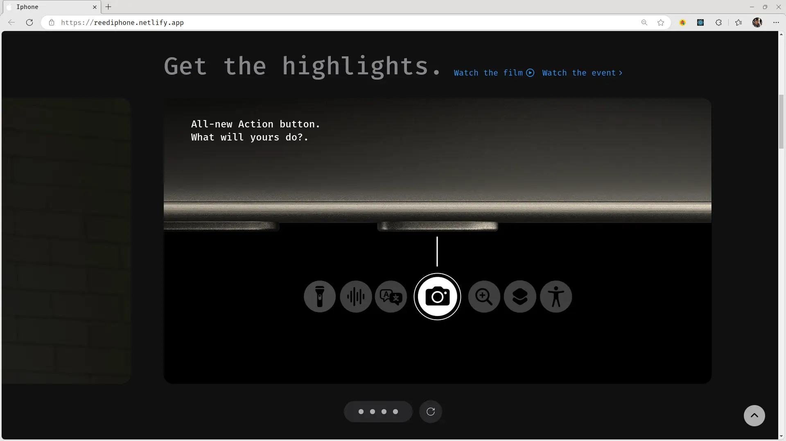
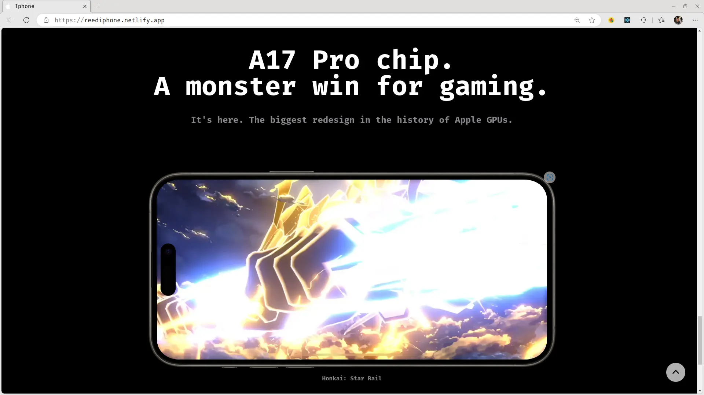

# Iphone 15 Landing Page

This is a simple landing page inspired by the great animations from the apple
landing page. It is mobile responsive with navigation setup for both the desktop
and mobile view.

***Tech stack used:***

- React-TS
- TailwindCSS
- GSAP for animations
- Three.js for 3d rendering

**See Site live on netlify @** *[reediphone.netlify.app](https://reediphone.netlify.app/)*

 

